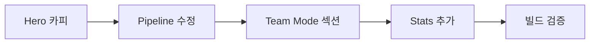

# Plan: vibe-skills-landing Team Mode 콘텐츠 업데이트

**Based on**: .vibe/001_team_mode_landing_update/research.md
**Date**: 2026-03-20 19:00
**Status**: DRAFT (미승인 - 구현 금지)
**Approval**: [ ] 미승인
**Risk Level**: Low
**Estimated Time**: 30min

---

## 0. Goals & Non-Goals

### Goals
- [ ] Team Mode 독립 섹션 추가 (Phases 뒤, Why Structured 앞)
- [ ] Hero 카피에 Team Mode 언급 반영
- [ ] Install Stats 숫자 정확도 유지
- [ ] Pipeline 화살표 하드코딩 수정

### Non-Goals
- 컴포넌트 분리/리팩토링 (현재 규모에서 불필요)
- 새 npm 의존성 추가
- 모바일 반응형 재설계
<!-- MEMO: -->

## 1. File Changes

### Modified Files
| Path | Change Type | Impact | Risk |
|------|------------|--------|------|
| `src/app/page.tsx` | 콘텐츠 추가 + 카피 수정 | Medium | Low |

### No New / Deleted Files
<!-- MEMO: -->

## 2. Per-File Change Details

### src/app/page.tsx

**Change 1: Hero 카피 업데이트 (line 128-133)**

Before:
```tsx
하나의 명령어.
<br />
<span className="text-muted">네 개의 단계.</span>
<br />
체계적인 개발.
```

After:
```tsx
하나의 명령어.
<br />
<span className="text-muted">네 개의 단계.</span>
<br />
<span className="text-muted">열한 개의 에이전트.</span>
<br />
체계적인 개발.
```

**Reason**: Team Mode의 11개 전문 에이전트를 Hero에서 숫자로 어필

---

**Change 2: Pipeline 화살표 하드코딩 수정 (line 158)**

Before:
```tsx
{i < 3 && (
```

After:
```tsx
{i < phases.length - 1 && (
```

**Reason**: phases 배열 길이 변경 시에도 화살표가 정상 동작하도록 수정

---

**Change 3: Team Mode 섹션 추가 (line 205 뒤, 207 앞)**

Phases `</section>` 뒤에 새 섹션 삽입. 기존 디자인 패턴 사용:
- 섹션: `pb-32 px-6` + `max-w-5xl mx-auto`
- 제목: `text-2xl font-light` + accent 하이라이트
- 카드: `p-6 bg-card border border-border rounded-lg`
- 코드블록: `bg-card border border-border rounded-md px-4 py-2`
- 태그: `text-xs font-mono text-dim px-2 py-0.5 bg-elevated rounded`

콘텐츠 구성:
1. **제목**: "복잡한 작업은 **팀**으로"
2. **설명**: AI가 자동으로 복잡도를 판단, 전문 에이전트 병렬 투입
3. **사용법 코드 예제**: `/vibe "team 인증 시스템 전체 분석"`
4. **에이전트 테이블**: 11개 에이전트 역할 표시 (3-column grid 카드)
5. **파이프라인 다이어그램**: TeamCreate → Phase별 워커 로테이션 → TeamDelete (텍스트 기반)
6. **사전 요구사항 노트**: omc 플러그인 필요 표시

---

**Change 4: Stats 업데이트 (line 263-264)**

Before:
```tsx
<span className="text-accent font-mono text-2xl font-light">5</span>
<p className="mt-1">스킬</p>
```

After:
```tsx
<span className="text-accent font-mono text-2xl font-light">6</span>
<p className="mt-1">스킬</p>
```

**Reason**: vibe + vibe-research + vibe-plan + vibe-implement + vibe-review + team mode = 6개 (또는 team을 mode로 카운트하면 5 유지 — team은 /vibe의 하위 모드)

실제로 team은 별도 스킬이 아닌 /vibe의 mode이므로 "5" 유지가 정확. 대신 새 stat 추가:

After (stat 추가):
```tsx
// 기존 5 / 1 / 0 뒤에 구분선 + 새 stat
<div className="w-px bg-border" />
<div>
  <span className="text-accent font-mono text-2xl font-light">11</span>
  <p className="mt-1">전문 에이전트</p>
</div>
```

<!-- MEMO: -->

## 3. Type/Interface Changes

변경 없음. 순수 JSX/콘텐츠 수정.
<!-- MEMO: -->

## 4. Implementation Strategy



### Phase 1: 기본 수정 (5min)
- [ ] Hero h1 카피 업데이트
- [ ] Pipeline 화살표 `i < 3` → `i < phases.length - 1`

### Phase 2: Team Mode 섹션 (20min)
- [ ] 새 섹션 JSX 작성 (Phases와 Why Structured 사이)
- [ ] 에이전트 3-column 카드 그리드
- [ ] 사용법 코드 예제
- [ ] 파이프라인 텍스트 다이어그램
- [ ] 사전 요구사항 노트

### Phase 3: 마무리 (5min)
- [ ] Stats에 "11 전문 에이전트" 추가
- [ ] `next build` 검증
<!-- MEMO: -->

## 5. Migration & Compatibility

해당 없음. 순수 콘텐츠 추가.
<!-- MEMO: -->

## 6. Test Strategy

| Type | Current | Target | Method |
|------|---------|--------|--------|
| Build | Pass | Pass | `next build --no-lint` |
| TypeCheck | Pass | Pass | `tsc --noEmit` |
| Visual | N/A | N/A | 브라우저에서 확인 |
<!-- MEMO: -->

## 7. Rollback Strategy

`git revert` — 단일 커밋으로 전체 변경 가능. 리스크 최소.
<!-- MEMO: -->

## 8. Alternatives & Tradeoffs

| Option | Pros | Cons | 선택 |
|--------|------|------|------|
| phases[]에 5번째 추가 | 자동 렌더링 | Team은 phase가 아닌 mode | ❌ |
| **독립 섹션** | 개념 분리, 주목도 | JSX 직접 작성 | ✅ |
| Why Structured 카드 추가 | 최소 변경 | 묻히는 위치 | ❌ |
<!-- MEMO: -->

## 9. Risk Analysis

| Risk | Probability | Impact | Level | Mitigation |
|------|------------|--------|-------|-----------|
| 빌드 실패 | 5% | Low | Low | tsc + next build 검증 |
| 모바일 레이아웃 깨짐 | 10% | Low | Low | 반응형 Tailwind 클래스 사용 |
| Hero 메시지 왜곡 | 15% | Medium | Low | 기존 톤 유지, 한 줄만 추가 |
<!-- MEMO: -->

## 10. Key Decision Questions

- [x] **Q1**: Team Mode를 phase로 추가? → No, 독립 섹션
- [x] **Q2**: 에이전트 수 (11개) 맞는지? → explore, analyst, architect, planner, critic, executor, designer, test-engineer, code-reviewer, security-reviewer, verifier = 11
- [x] **Q3**: Stats에서 스킬 수 변경? → 5 유지 (team은 mode), "11 에이전트" stat 추가
<!-- MEMO: -->

## 11. AI Review Report

완성도: 90/100
- 모든 변경 사항이 단일 파일에 집중
- 기존 디자인 패턴 100% 재사용
- 새 의존성 없음
- 리스크 최소 (순수 콘텐츠 추가)

부족한 점:
- 에이전트 카드의 정확한 카피 문안은 구현 시 확정 필요

## 12. Decisions & Rationale
- **Decided**: 독립 섹션(Option B) + Hero에 에이전트 수 추가 + Stats에 "11 에이전트" stat
- **Rejected**: phases[] 배열 확장 (개념적 부적합), 컴포넌트 분리 (over-engineering)
- **Risks**: Hero 카피 한 줄 추가가 레이아웃에 영향 → sm/md/lg 에서 확인 필요
- **Remaining**: Team Mode 섹션의 정확한 카피 문안, 에이전트 카드 세부 내용
<!-- MEMO: -->

## Approval Checklist
- [x] Research up to date
- [x] Goals/non-goals clear
- [x] File paths confirmed
- [x] Test strategy confirmed
- [x] Rollback strategy confirmed
- [x] Risk level acceptable
- [x] AI review score > 80
- [ ] **Developer final approval**: [ ]

**Next: After approval, run `/vibe "구현해"` to start implementation**
