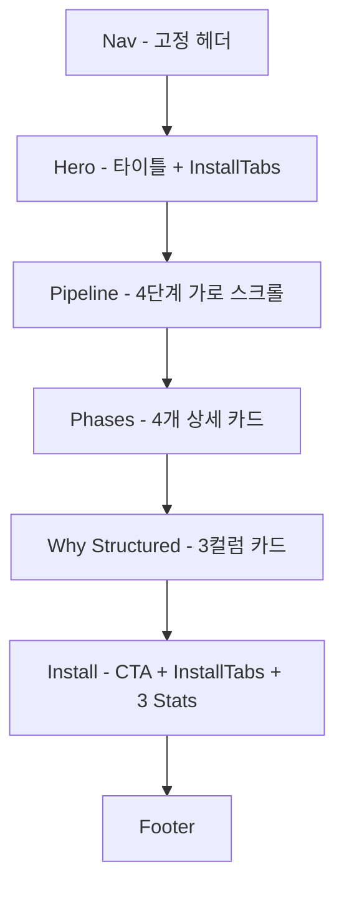

# Research: vibe-skills-landing Team Mode 콘텐츠 업데이트

**Date**: 2026-03-20 18:30
**Index**: 001
**Status**: research-only
**Modes**: team (explore + analyst + architect)
**Tags**: #landing-page #team-mode #content-update

---

## 1. File/Function/Type Map

| File Path | Role | Complexity | Change Risk |
|-----------|------|-----------|-------------|
| src/app/page.tsx:1-314 | 전체 랜딩 페이지 (nav + 모든 섹션) | Medium | Medium |
| src/app/page.tsx:5-19 | CopyButton 컴포넌트 | Low | None |
| src/app/page.tsx:21-53 | InstallTabs 컴포넌트 | Low | None |
| src/app/page.tsx:56-89 | phases[] 데이터 배열 | Low | Low |
| src/app/page.tsx:91-314 | Home 컴포넌트 (모든 섹션 렌더링) | Medium | Medium |
| src/app/globals.css:1-51 | 디자인 토큰 + 애니메이션 | Low | None |
| src/app/layout.tsx:1-39 | RootLayout + 메타데이터 | Low | Low |

## 2. Current Page Flow

## 3. 현재 콘텐츠 상세

### Hero (page.tsx:120-144)
- h1: "하나의 명령어. / 네 개의 단계. / 체계적인 개발."
- subtitle: "자연어를 분석, 계획, 구현, 리뷰된 코드로 바꾸는 AI 기반 워크플로우"

### Pipeline (page.tsx:146-165)
- 4개 pill 체인: 01 분석 → 02 계획 → 03 구현 → 04 리뷰
- **주의**: line 158에 `i < 3` 하드코딩 (화살표 커넥터)

### Phases (page.tsx:167-205)
- phases[] 배열(line 56-89) 기반 렌더링
- 각 phase: num, name, label, cmd, desc, tags[]

### Why Structured (page.tsx:207-241)
- 3-column grid: 관심사의 분리, 재현 가능한 산출물, 내장된 품질 게이트

### Install (page.tsx:243-284)
- Stats: "5 스킬", "1 명령어", "0 설정" (하드코딩)

## 4. 디자인 시스템

### 컬러 토큰 (globals.css:3-13)
| Token | Value | Usage |
|-------|-------|-------|
| `--accent` | `#D4714E` | 브랜드 오렌지: phase 번호, 코드, CTA |
| `--bg` | `#0A0A0A` | 배경 |
| `--bg-card` | `#141414` | 카드 배경 |
| `--bg-elevated` | `#1A1A1A` | 탭 배경 |
| `--text` | `#FAFAFA` | 본문 텍스트 |
| `--text-muted` | `#888888` | 보조 텍스트 |
| `--text-dim` | `#555555` | 태그, 딤 텍스트 |
| `--border` | `rgba(255,255,255,0.06)` | 구분선 |

### 재사용 가능한 패턴
- **카드**: `p-6 bg-card border border-border rounded-lg`
- **Phase 그리드**: `grid md:grid-cols-[140px_1fr] gap-8`
- **태그 pill**: `text-xs font-mono text-dim px-2 py-0.5 bg-elevated rounded`
- **코드 블록**: `bg-card border border-border rounded-md px-4 py-2` + `font-mono text-sm text-accent`

### 폰트
- Sans: Geist (next/font/google)
- Mono: Geist Mono

### 애니메이션
- `animate-fade-up` + `animate-delay-{1-4}` (Hero에서만 사용)
- `animate-delay-4` 정의됨 but 미사용

## 5. Team Mode 관련 기존 콘텐츠

**없음** — "team", "parallel", "agents", "coordinate" 관련 콘텐츠 없음.

## 6. 기술 스택

| 항목 | 기술 | 버전 |
|------|------|------|
| Framework | Next.js | 16.2.0 |
| UI Runtime | React | 19.2.4 |
| Styling | Tailwind CSS v4 | ^4 (PostCSS) |
| Fonts | Geist Sans + Mono | next/font/google |
| Animation | CSS keyframes | 자체 구현 |
| Icons/CMS | None | - |

## 7. 삽입 지점 분석

### 권장: Option B — 독립 섹션 (Phases와 Why Structured 사이)

| Option | 위치 | 장점 | 단점 |
|--------|------|------|------|
| A) phases[] 배열에 5번째 추가 | page.tsx:56-89 | 자동 렌더링 | Team Mode는 phase가 아님 (mode) |
| **B) 독립 섹션** | page.tsx:205-207 사이 | 개념적 분리, 주목도 높음 | JSX 직접 추가 필요 |
| C) Why Structured에 카드 추가 | page.tsx:215-228 | 최소 변경 | 묻히는 위치 |

**Team Mode는 4단계를 감싸는 병렬 실행 모드이므로, 별도 독립 섹션(Option B)이 적합.**

## 8. 업데이트 필요 항목

### 필수 변경
1. **새 섹션 추가**: Team Mode 소개 (Phases 섹션 뒤)
2. **Hero 카피 업데이트**: "네 개의 단계" → Team Mode 언급 포함
3. **Stats 업데이트**: "5 스킬" → 실제 수 반영

### 선택 변경
4. Nav에 `#team` 앵커 링크 추가
5. Pipeline 섹션 화살표 `i < 3` → `i < phases.length - 1` 수정
6. layout.tsx 메타데이터 description 업데이트

## 9. 리스크 & 영향

| Risk | Severity | Scope | Action |
|------|----------|-------|--------|
| page.tsx 파일 길이 증가 (314→~450줄) | Low | 유지보수성 | 현재 규모에서는 무시 가능 |
| Hero 카피 변경으로 메시지 왜곡 | Medium | 마케팅 | 신중한 카피라이팅 필요 |
| Pipeline 화살표 하드코딩 | Low | 버그 | 즉시 수정 (phases 추가 시 깨짐) |
| 모바일 반응형 검증 | Low | UX | 추가 후 375px 테스트 |

## 10. Summary & Next Steps

### 핵심 발견
1. 단일 파일(page.tsx 314줄) Next.js 16 앱, "use client" 전체 적용
2. phases[] 데이터 배열 패턴으로 콘텐츠 구조화
3. Tailwind v4 디자인 토큰 완비, 컴포넌트 라이브러리 없음
4. Team Mode 관련 기존 콘텐츠 전무 — 완전 신규 추가

### 즉시 조치
- Option B (독립 섹션) 방식으로 Team Mode 섹션 설계
- Hero/Stats 카피 업데이트 계획
- Pipeline 화살표 하드코딩 수정

### 다음 단계
**`/vibe "계획 세워줘"` 로 구현 계획 수립**

## Decisions & Rationale
- **Decided**: Team Mode를 독립 섹션으로 추가 (Phases 뒤, Why Structured 앞)
- **Rejected**: phases[] 배열에 5번째로 추가 (Team Mode는 phase가 아닌 mode이므로 개념적으로 부적합)
- **Risks**: Hero 카피 변경 시 기존 메시지 훼손 가능성, page.tsx 길이 증가
- **Remaining**: 정확한 Team Mode 섹션 디자인, 카피 문안, 에이전트 테이블 레이아웃
